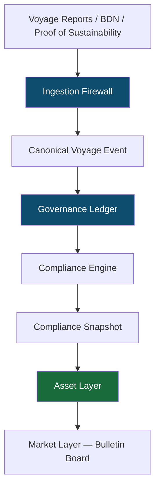

# VELONAUT
### Maritime Compliance Infrastructure — From Operational Data to Verified Economic Assets

> *The shipping industry moves 90% of world trade and generates 3% of global CO₂ emissions.*
> *Existing compliance tools process the numbers. Velonaut proves them.*

---

## The Problem with "Compliance Platforms"

Most maritime compliance tools are sophisticated spreadsheets. They aggregate data, apply regulatory formulas, and produce reports. What they cannot do is answer the one question that regulators, banks, and trading partners actually need answered:

**Can you prove this?**

Without a cryptographically verifiable audit trail, every compliance report is, at best, an educated estimate — and at worst, an invitation to greenwash.

Velonaut was built on a different premise: that regulatory truth must be *derived*, not declared.

---

## Operational Reality → Regulatory Truth → Economic Assets

This is the Velonaut data model — three worlds, each deterministically derived from the last.



Raw maritime data — Noon Reports, Bunker Delivery Notes, Sustainability Proofs — enters through a strict **Ingestion Firewall**. It is normalised, validated, and transformed into a **Canonical Voyage Event**. This event is hashed and written to an **append-only Governance Ledger**. From the ledger, the **Compliance Engine** derives regulatory metrics deterministically. From those metrics, the **Asset Layer** mints verified compliance assets. From those assets, the **Market Layer** enables transparent peer-to-peer trading.

At no point can any layer write backwards. At no point can a result be declared without proof.

---

## Why Velonaut Outperforms the Competition

| Capability | Market Standard | Velonaut |
|-----------|----------------|---------|
| Data Model | Mutable database | Append-only event ledger |
| Audit Trail | Report-based | Cryptographic (SHA-256) |
| Duplicate Protection | Manual | Deterministic event ID |
| Floating-Point Arithmetic | Common | Forbidden — `Decimal` only |
| RED III / RFNBO | Not supported | Native integration |
| Compliance Pooling | Offline agreements | Digital pooling module |
| Market Layer | Matching engine (exchange risk) | Bulletin Board (regulatory safe) |
| Counterparty Management | Address book | Institutional KYC + LEI layer |
| Asset Ownership | Vessel-level | Tenant-level (regulatorily correct) |
| Future-Ready | Static | AI-assisted, multimodal, agentic |

---

## The Ingestion Firewall

Raw data never reaches the ledger. Ever.

Every input — whether a CSV Noon Report, a JSON fleet API, or a ZIP archive — passes through a deterministic pipeline before a single byte enters the system.

```python
# Invariants enforced at every ingestion:
#
# · No floating-point arithmetic. Exclusively decimal.Decimal (precision 18,6).
# · event_id = SHA256(canonical_json) → deterministic and auditable.
# · Identical input → identical event_id → automatic duplicate rejection.
# · Raw data never reaches the ledger. Only CDM events are committed.
# · ZIP: max 100 files, max 50 MB uncompressed. Nested ZIPs rejected.
# · Every ledger write: block type VOYAGE_EVENT.
# · No direct database access. Service delegation only.
```

The result: a pipeline where *identical inputs always produce identical outputs* — a property we call **deterministic replay**. Any compliance result can be reconstructed from scratch, at any time, by any auditor.

---

## The Canonical Voyage Event

Every voyage, regardless of its source format, becomes a single standardised object before entering the ledger:

```json
{
  "event_id": "sha256:a3f9...c201",
  "schema_version": "OVD-PIPELINE-v1",
  "imo_number": "9876543",
  "report_period_start": "2024-11-01T00:00:00Z",
  "report_period_end": "2024-11-02T00:00:00Z",
  "distance_sailed_nm": "312.500000",
  "position_lat": "53.550000",
  "position_lon": "9.993000",
  "fuels": [
    {
      "fuel_type": "VLSFO",
      "fuel_origin": "FOSSIL",
      "fuel_consumption_mt": "18.420000",
      "fuel_lcv_mj_per_kg": "40.300000",
      "fuel_co2_factor": "3.151000"
    },
    {
      "fuel_type": "e-Methanol",
      "fuel_origin": "RFNBO",
      "fuel_consumption_mt": "4.100000",
      "fuel_lcv_mj_per_kg": "19.900000",
      "fuel_co2_factor": "0.375000"
    }
  ],
  "provenance": {
    "source_file_hash": "sha256:b8d2...f044",
    "adapter_id": "csv_noon_report_adapter",
    "ingestion_timestamp": "2024-11-02T08:14:33Z"
  }
}
```

An auditor can follow this chain at any time:

`Ledger Event → Adapter → Original Record → Original File`

---

## The Asset Layer: Compliance as a Tradeable Good

When a vessel overperforms against its FuelEU or RED III targets, Velonaut does not issue a certificate. It **mints a verified asset** — provably derived from ledger events, unreachable without a complete audit chain.

Assets are owned by the **tenant** (the responsible legal entity), not the vessel. This is the regulatorily correct model under both FuelEU Maritime and EU ETS, and it enables fleet-level balancing, pooling, and future trading without architectural rebuilds.

**Asset types currently in scope:**
- `FUEL_EU_SURPLUS_UNIT` — transferable within fleets and pools
- `RED_III_QUOTA_TOKEN` — RFNBO multiplier-adjusted, PoS-linked
- `COMPLIANCE_FUTURE` — forward contract on projected surplus (roadmap)

---

## The Market Layer: A Bulletin Board, Not an Exchange

Velonaut does not operate a matching engine. This is a deliberate architectural and regulatory decision.

A matching engine can expose a platform to classification as a trading venue under MiFID II, requiring financial market licensing from BaFin or ESMA. A **Bulletin Board** — where participants list assets, signal interest, and execute bilateral transfers — provides full market functionality without that regulatory exposure.

This is not a limitation. It is precisely how institutional compliance markets operate.

---

## RED III & RFNBO: Built for What's Coming

While most platforms treat RED III as a future problem, Velonaut treats it as an architectural requirement from day one.

Every fuel ingestion carries an `fuel_origin` flag (`FOSSIL | BIO | RFNBO`). Every e-fuel consumption event requires a linked **Proof of Sustainability** in the ledger before an RFNBO multiplier is applied. No certificate, no bonus. The system does not allow declaration without proof.

---

## The Vision

Velonaut is compliance infrastructure for an industry that has never had any.

The roadmap moves toward a fully AI-assisted, multimodal platform — where fleet managers interact through natural language, agents surface compliance risks in real time, and the ledger remains the silent, unimpeachable source of truth beneath it all.

The oceans do not need more reports. They need a system that makes it economically irrational to pollute and financially rewarding to comply.

That is what we are building.

---

## Architecture

**Core:** Python · Event Sourcing · Append-only Ledger · Ed25519 Signatures

**Compliance:** FuelEU Maritime · EU ETS · RED III / RFNBO

**Market:** Bulletin Board · Compliance Pooling · Bilateral Transfers

**Roadmap:** AI Layer · Multimodal Interface · Agentic Operations · Futures Module

---

<sub>Velonautics · Hamburg · hello@velonautics.com · 
